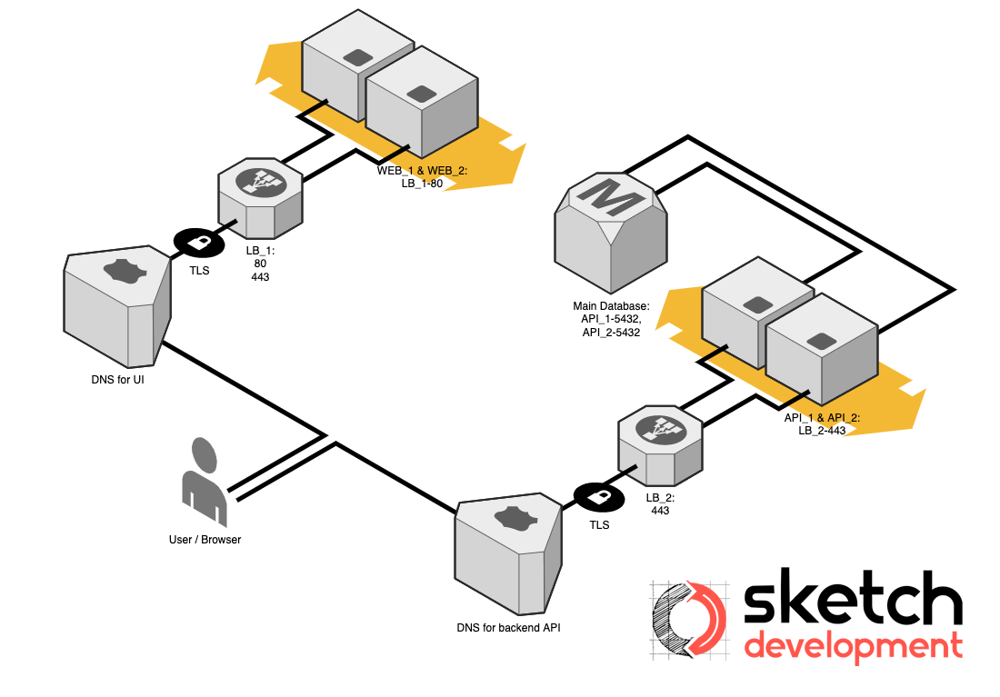

# Sketch Infrastructure-as-Code Webinar Demo

[Sketch Development Services](https://sketchdev.io) hosts a [webinar](https://sketchdev.io/how-to-improve-security-speed-and-savings-with-infrastructure-as-code-webinar) discussing security, speed, and cost savings benefits when using Infrastructure-as-Code to manage your application environments.

During the webinar, the sample code in this repository is used to create multiple application environments. This demonstrates setting up an infrastructure very very very similar to that in the following figure (the web portion leverages AWS-specific native services, while the diagram replaces that with comparable, traditional architecture):

[Figure 1]

## Launching This Yourself

***NOTE***: Launching these CloudFormation stacks in AWS will incur an hourly charge while systems are running! Be sure to delete the stack when done to ensure you aren't continuing to pay for the allocated resources!

There is some "secret-sauce" not provided with this repository that establishes the underlying network and core DNS hosted zone. Without these items, these templates will not run successfully on their own. You are welcome to find occurrences of `Fn::ImportValue:` within the `./src/templates` YAML templates and replace with values that match your existing setup. Then, this should run successfully for you within your environment(s).

### Prerequisites

  1. View the AWS documentation for details on how to [install and configure](https://docs.aws.amazon.com/cli/latest/userguide/cli-chap-welcome.html) the AWS command line interface (CLI).
  2. Have access to a Linux-compatible Bash shell for running the scripts in this repository

### Configuring

There is a `./src/scripts/config.sh` file that you should open and alter according to your application-specific needs

  * **PLATFORM_NAME** is used for tagging resources when deployed to AWS as well as for a couple of naming purposes. Change this to the name of your application
  * **PLATFORM_WEB_DOMAIN** is for your application's domain. This needs to be set so appropriate SSL Certificates and DNS entries will be established

### Running

To deploy this infrastructure as an environment into AWS, you will need to make use of the scripts in `./src/scripts`.  `buildApi.sh` must be executed ***after*** `buildRds.sh` successfully completes. `buildWebDistro.sh` may be run at any point without any dependency issues related to the other two scripts.  View these scripts to see what parameters they require being passed to them when executed.
